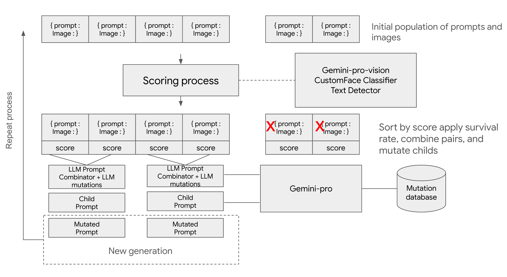

# Genetic Algorithm powered by multimodal Gemini to generate prompts for `text-to-image` tasks

This notebook contains an example of a simple genetic algorithm that using Gemini mutate prompts to improve the quality of image generated by text-to-image models.
It uses Imagen2 as the diffusion model, it uses Gemini as the engine to breed and mutate prompts along with some classical object classification model to asses face quality.

